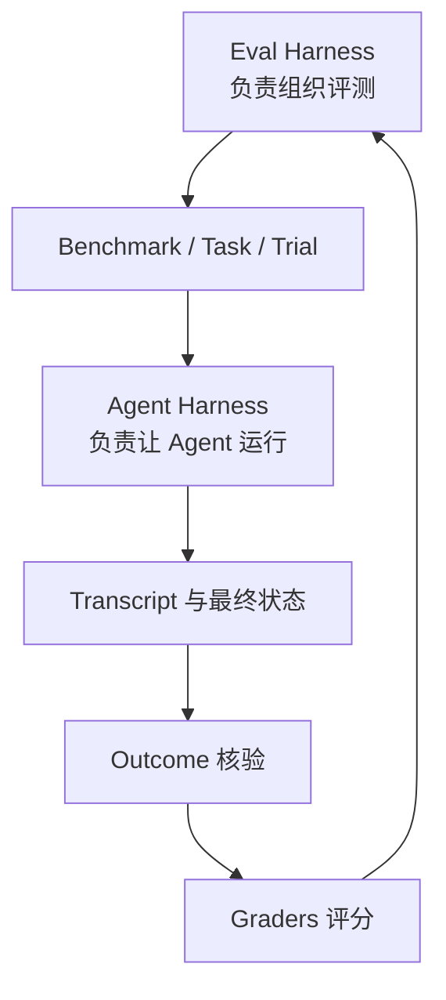

# Agent 与 Harness

已理解

## 什么是 Agent

可以把 Agent 理解成一个会循环执行“观察—判断—行动—检查”的系统。它不只生成回答，还可能调用工具、修改环境状态、委托后台能力或请求人工帮助。

## Harness 是什么

Harness 不是单纯的一份 SOP。它更像让多种角色真正协同运转的“运行系统”：规定输入如何进入、状态如何保存、工具如何被调用、错误如何处理、结果如何记录。

### Agent Harness

负责让 Agent 实际工作：

- 接收视频、图像、音频和文字；
- 维护历史上下文与长期记忆；
- 运行模型的策略循环；
- 执行 Speak、Silence、Delegate；
- 调用工具或子 Agent；
- 更新外部环境与内部状态。

### Eval Harness

负责测试 Agent：

- 加载 Benchmark；
- 初始化并重置测试环境；
- 批量运行多个 Task 和 Trial；
- 保存 Transcript；
- 核验 Outcome；
- 调用多个 Grader；
- 汇总指标、Bad Case 和版本对比。

## 一个比喻

| 概念 | 驾驶考试类比 |
| --- | --- |
| Agent Harness | 让车辆可以被驾驶的整套车载系统 |
| Eval Harness | 考场、路线、监控、裁判和成绩系统 |
| Benchmark | 整套考试项目与规则 |
| Task | 一个考试项目，例如侧方停车 |
| Trial | 考生对该项目的一次尝试 |
| Transcript | 行车记录仪与操作日志 |
| Outcome | 是否真的停进指定位置 |
| Grader | 安全、耗时、规范等不同评分员 |

## 关系

