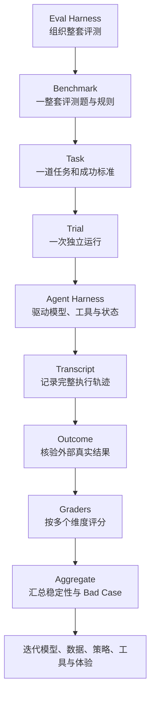

LUNA'S LEARNING DESK / 01

# 从零理解多模态 Agent 评测

这是一个从个人提问出发、持续生长的学习知识库。它帮助初学者把“模型效果好不好”，一步步拆成可以设计、运行、记录、评分和复现的评测系统。

[开始学习](learning-path.md){ .md-button .md-button--primary }
[查看完整流程](system/overview.md){ .md-button }

  已理解
  正在验证
  待补充

!!! info "这个知识库是什么"
    它首先服务于我的个人学习、复盘与知识积累，同时公开分享给有相同需要的人。内容来自公开资料、案例分析和个人理解，不代表任何公司的内部 SOP，也不把学习研究包装成真实项目经历。

## 你可以从这里找到什么

-   :material-map-outline:{ .lg .middle } **一张完整地图**

    ---

    从 Eval Harness、Benchmark、Task、Trial，到 Transcript、Outcome 和 Grader，理解整套系统如何运转。

    [:octicons-arrow-right-24: 查看总体结构](system/overview.md)

-   :material-timeline-text-outline:{ .lg .middle } **可追踪的执行轨迹**

    ---

    了解 Transcript 如何记录观察、策略、Speak、Silence、Delegate、工具返回和状态变化。

    [:octicons-arrow-right-24: 学习 Transcript](system/transcript.md)

-   :material-shield-check-outline:{ .lg .middle } **结果与评分**

    ---

    区分模型“说完成了”和任务“真的完成了”，再用多个 Grader 检查质量、风险、成本和稳定性。

    [:octicons-arrow-right-24: 理解 Outcome 与 Grader](system/outcome-grader.md)

-   :material-flask-outline:{ .lg .middle } **一个可执行的练习**

    ---

    用跌倒预警案例，把视频输入、策略循环、工具调用、外部状态和评分指标串成一次完整 Trial。

    [:octicons-arrow-right-24: 打开案例](practice/fall-detection.md)

## 一眼看懂评测主链路

## 搜索建议

点击页面顶部的搜索，尝试输入：

`Transcript` · `Speak` · `Silence` · `Delegate` · `Outcome` · `Grader` · `Fallback` · `Pass@k`

每个结果会带你进入一个可以独立理解、又与上下游概念相连接的页面。

