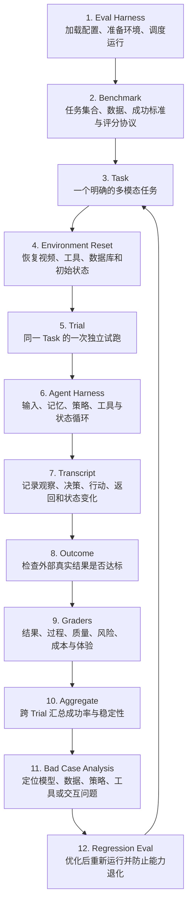

# 评测系统总体结构

已理解

这张纵向图展示了多模态 Agent 评测从准备到迭代的完整主链路。每一个节点都可以在本站单独搜索。

## 每层分别负责什么

| 层级 | 输入 | 主要工作 | 输出 |
| --- | --- | --- | --- |
| Benchmark | 产品目标与真实风险 | 组织任务、数据与规则 | 一套可复用测试包 |
| Task | 一个具体场景 | 定义输入和成功标准 | 可执行任务 |
| Trial | Task 与初始环境 | 独立运行一次 Agent | Transcript 与最终状态 |
| Transcript | 运行中的所有事件 | 保存可审查证据 | 完整执行轨迹 |
| Outcome | 最终外部状态 | 判断任务是否真的完成 | 成功、部分成功或失败 |
| Grader | Outcome 与 Transcript | 按多个维度评分 | 单项分数与解释 |
| Aggregate | 多个 Trial 的结果 | 统计稳定性和版本差异 | 报告与 Bad Case |

## 为什么一个 Task 要运行多个 Trial

Agent 具有随机性。同一个输入可能因为采样、工具延迟、上下文或策略选择产生不同结果。一次成功只能说明“这次成功了”，不能证明系统稳定。

下一步可以深入阅读 [Transcript](transcript.md)，查看一次 Trial 内部究竟记录什么。

