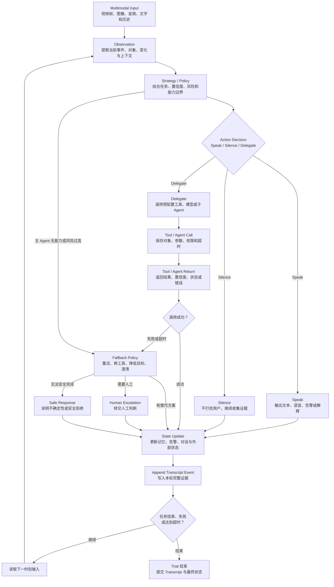

# Transcript：完整执行轨迹

已理解

Transcript 是一次 Trial 的完整、带时间戳的执行记录。它回答的不是“最后说了什么”，而是“模型在每个时刻看到了什么、为什么这样判断、做了什么、得到了什么返回、状态发生了什么变化”。

## Transcript 的内部循环

## 必须记录的字段

| 字段 | 记录内容 | 多模态例子 |
| --- | --- | --- |
| Timestamp | 视频时间、系统时间、各环节耗时 | 08.40 秒出现疑似跌倒 |
| Input Reference | 视频 ID、帧区间、音频、用户指令 | camera-03 / 08.40–09.20s |
| Observation | 从输入中观察到的事实 | 人体重心快速下降并倒地 |
| Strategy / Policy | 目标、风险、置信度和策略理由 | 证据不足，继续观察 0.5 秒 |
| Action Decision | Speak、Silence 或 Delegate | Delegate |
| Model Output | 文本、语音或结构化指令 | “正在确认疑似跌倒” |
| Tool / Agent Call | 调用对象、参数、权限和超时 | 动作复核模型，超时 800ms |
| Tool / Agent Return | 数据、错误、置信度和状态 | fall=true, confidence=0.94 |
| State Before / After | 行动前后的内部与外部状态 | 未告警 → 待发送 → 已发送 |
| Fallback | 重试、降级、转人工或安全拒绝 | 通知超时后改发短信 |
| Final Status | 完成、部分完成、失败或超时 | 通知成功，语音失败 |

## Transcript 不等于视频文件

一般不需要把整段视频重复写进日志。更常见的做法是保存视频或帧的引用、时间区间、关键证据和每个决策事件，确保评测人员可以复现和定位问题。

## Transcript 用来做什么

- 区分“没有看见”和“看见了但选择 Silence”；
- 检查 Delegate 是否选对工具、传对参数；
- 定位延迟来自模型、工具、TTS 还是前端；
- 检查失败时是否执行了 Fallback；
- 解释为什么 Outcome 成功或失败；
- 为过程、安全、成本和体验 Grader 提供证据。

